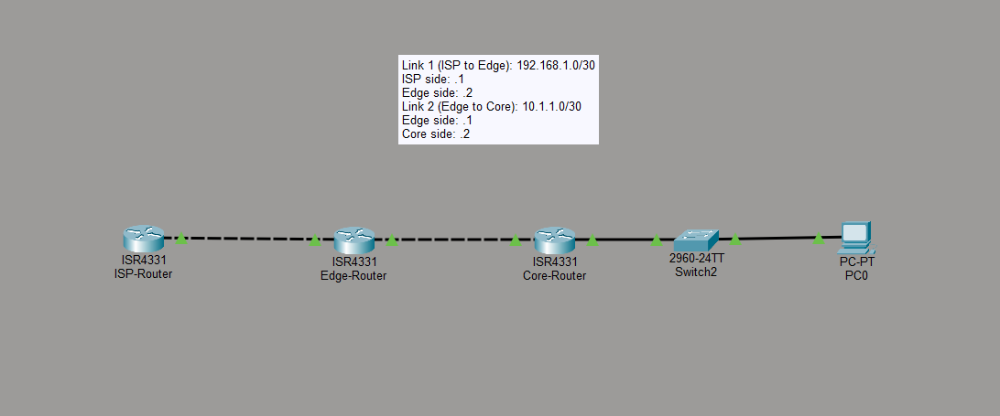
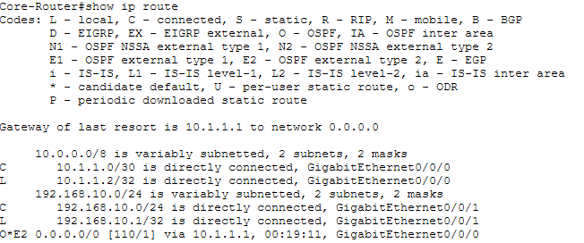
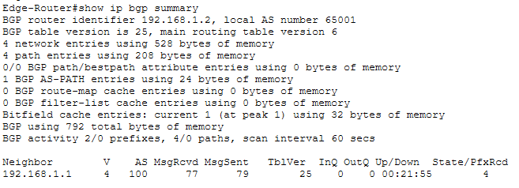
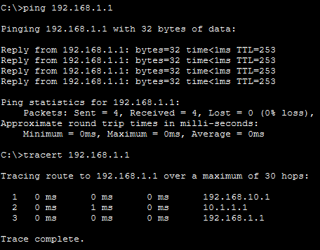

# 🌐 Enterprise Edge Connectivity: BGP & OSPF Integration

A Cisco Packet Tracer simulation of a production-standard **Single-Homed Enterprise Edge** design — demonstrating how internal corporate routing (OSPF) hands off to an external service provider (eBGP) to reach the internet.

> Built with Cisco IOS · OSPF Area 0 · eBGP AS 65001 · Cisco ISR 4331

---

## 📖 Overview

This lab replicates a real-world enterprise edge scenario commonly found in small-to-medium corporate networks. It covers the full routing lifecycle — from a user PC on the internal LAN, through the OSPF domain, across the ASBR handoff, and out via eBGP to the ISP.

```
[ PC0 ]──────[ Core-Router ]──────[ Edge-Router (ASBR) ]──────[ ISP-Router ]
          192.168.10.0/24    OSPF ↔ BGP Redistribution      eBGP AS 65001
```

---

## 🏗️ Key Features

- **Dynamic Routing Integration** — Bridges OSPF Area 0 (internal) with eBGP AS 65001 (external) via route redistribution at the ASBR.
- **Default Route Propagation** — The Edge-Router uses `default-information originate` to automatically advertise an internet exit to all OSPF-speaking routers — no static routes required on the Core.
- **Conservative Subnetting** — `/30` point-to-point links on all router-to-router connections to minimize address waste.
- **Autonomous System Border Router (ASBR)** — The Edge-Router is fully configured as the policy enforcement point between internal and external routing domains.

---

## 🗺️ Topology



| Device | Role | Key Interface(s) |
| :--- | :--- | :--- |
| **PC0** | End-user host | `192.168.10.x/24` |
| **Core-Router** | Internal gateway, OSPF speaker | LAN: `192.168.10.1`, WAN: `10.1.1.2/30` |
| **Edge-Router** | ASBR — OSPF ↔ eBGP boundary | Internal: `10.1.1.1/30`, External: `192.168.1.2/30` |
| **ISP-Router** | eBGP peer, internet gateway | `192.168.1.1/30` |

---

## 🚀 Routing Logic

The traffic flow follows a clear handoff chain across two routing protocols:

**1. OSPF Domain (Internal)**
- The Core-Router advertises the Office LAN (`192.168.10.0/24`) into OSPF Area 0.
- The Edge-Router injects a default route (`0.0.0.0/0`) into OSPF via `default-information originate`, giving the Core an automatic internet exit.

**2. BGP Domain (External)**
- The Edge-Router peers with the ISP-Router via eBGP (AS 65001 ↔ ISP AS).
- Internal OSPF prefixes are redistributed into BGP at the ASBR for advertisement upstream.
- The ISP-Router provides the default route back, which propagates down through the entire OSPF domain.

---

## 🧪 Verification & Testing

Three tests confirm the network is end-to-end functional.

---

### 1. Internal Routing — Core-Router

**Command:** `show ip route`  
**Purpose:** Confirms the Core-Router has learned the default route (`0.0.0.0/0`) via OSPF, proving `default-information originate` is working correctly.



✅ **Expected:** An `O*E2 0.0.0.0/0` entry pointing toward the Edge-Router.

---

### 2. External Peering — Edge-Router

**Command:** `show ip bgp summary`  
**Purpose:** Verifies the eBGP session between the Edge-Router and ISP-Router has reached the `Established` state and is exchanging prefixes.



✅ **Expected:** Neighbor `192.168.1.1` shows state `Established` with a non-zero prefix count.

---

### 3. End-to-End Connectivity — PC0

**Commands:** `ping 192.168.1.1` and `tracert 192.168.1.1`  
**Purpose:** Proves full packet flow from the user LAN, through the OSPF domain, across the ASBR, and out to the ISP gateway.



✅ **Expected traceroute hop path:**
```
1  192.168.10.1   (Core-Router — LAN gateway)
2  10.1.1.1       (Edge-Router — ASBR)
3  192.168.1.1    (ISP-Router — destination)
```

---

## 🛠️ How to Use This Repo

**1. Download**
Clone the repo or download the `.pkt` file directly from the root directory.

**2. Open**
Launch `Enterprise_Edge_BGP_OSPF_Lab.pkt` in **Cisco Packet Tracer v8.0 or later**.

**3. Explore**
- Run `show run` on any router to inspect the full IOS configuration.
- Check the `/configs` folder for text-based config files — useful for reference without opening Packet Tracer.
- Use Packet Tracer's **Simulation Mode** to step through packet flow hop-by-hop.

---

## 📂 Repository Structure

```
/
├── Enterprise_Edge_BGP_OSPF_Lab.pkt    # Cisco Packet Tracer source file
├── LICENSE
├── README.md
├── topology/
│   └── network_diagram.png             # Visual topology diagram
├── configs/
│   ├── Core_Router_Config.txt          # Core-Router running config
│   ├── Edge_Router_Config.txt          # Edge-Router (ASBR) running config
│   └── ISP_Router_Config.txt           # ISP-Router running config
└── docs/
    ├── Core_Routing_Table.png          # show ip route output
    ├── BGP_Status.png                  # show ip bgp summary output
    └── PC0_Connectivity.png            # ping & tracert results
```

---

## 📄 License

[MIT](https://choosealicense.com/licenses/mit/) — free to use and adapt for your own labs.
